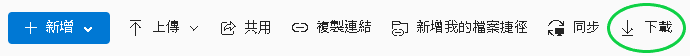
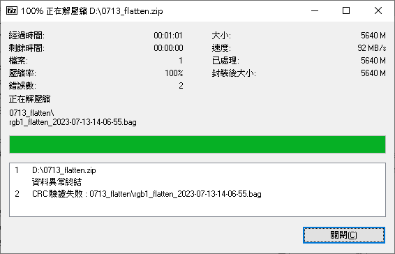
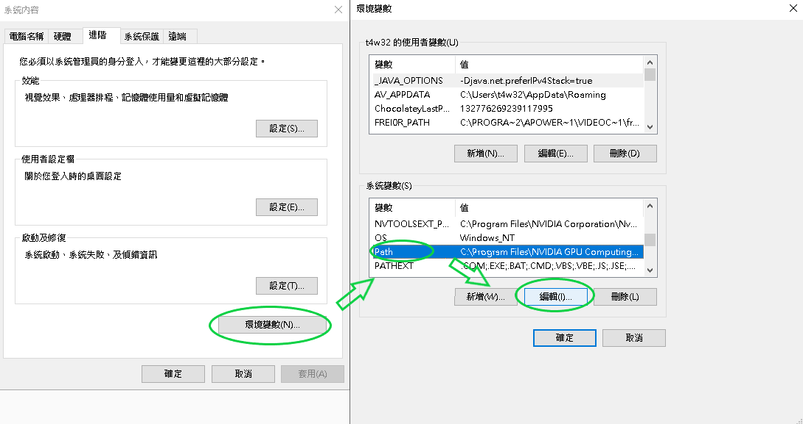
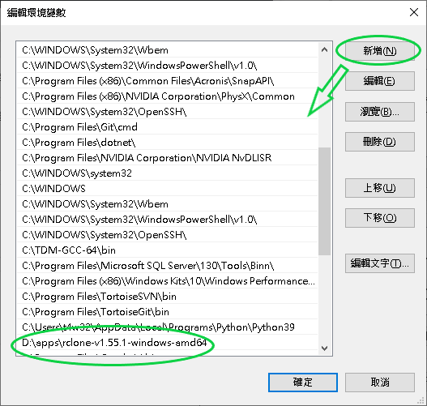
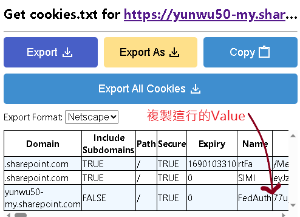
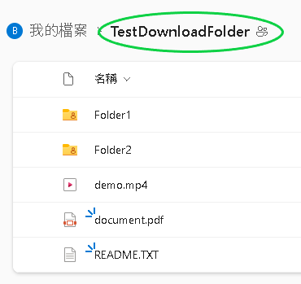
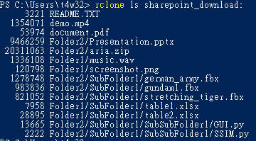

# LargeSharepointDownload
 下載大容量的Sharepoint資料夾\
 [Read On HackMD](https://hackmd.io/@frakw/BJYCBAQch)
## Demo Use :
* [Sharepoint Folder Link](https://mailntustedutw-my.sharepoint.com/:f:/g/personal/b10815057_ms_ntust_edu_tw/Es39WLciVAhBksY52KNsNAwBgf1_Cs4Br_YmVyejI_bWNQ?e=ZrdmF9)
* Password : `pass`
## Use Tools
* [Rclone](https://rclone.org/downloads/) (version larger than 1.56.0)
    >you can use `rclone selfupdate` to upgrade to latest version
    >`rclone --version` to check current version
* [Get Cookie.txt](https://chrome.google.com/webstore/detail/get-cookiestxt-locally/cclelndahbckbenkjhflpdbgdldlbecc)
## 中文版
### 起因
一般來說，只要Sharepoint的資料夾含有數GB的大小，使用網頁版的下載鈕進行下載

得到的zip檔要進行解壓縮都會出現錯誤，甚至載下來的大小根本就與資料夾大小不符

不管重載幾次都是同樣的結果，最終只能一個一個檔案慢慢下載，非常麻煩
這問題真的是困擾了我好久，只能說在下載這方面，Google Drive真的是做得比Sharepoint好太多了==

---

### 解法
以前我曾經將別人的專案修改成一個Sharepoint的下載器(Windows) [(Link)](https://github.com/frakw/sharepoint_downloader)，但後來因為api有更新，所以這工具就不能使用了。
目前最新發現的方法是使用[Rclone](https://rclone.org/)搭配其中的[Webdav](https://rclone.org/webdav/)來進行下載，以下進行教學示範:
> 註:本教學以Windows系統為主，其他OS會略有不同，但都可以使用
1. 安裝Rclone (一款實用的雲端管理工具)
    > 已經安裝過的人要確保rclone版本大於1.56.0 (`rclone --version`)
    > 若版本過低，可以使用`rclone selfupdate`來自動升級成最新版
    * 進入[下載頁面](https://rclone.org/downloads/)，根據作業系統與架構選擇你要的壓縮包 (一般電腦選Intel/AMD - 64 Bit即可)，解壓縮到你想放的位置
    * 複製`rclone.exe`所在的路徑，以我的來說是`D:\apps\rclone-v1.55.1-windows-amd64\`
    * 進入「進階系統設定」->「環境變數」->「系統變數」->「Path」->「編輯」
    
    * 按下新增，並將rclone路徑貼上，如此一來，便能在電腦的任何位置存取到`rclone.exe`
    
2. 使用任何方式來獲取Sharepoint網站的Cookie，然後先複製存起來
    * 這裡推薦使用Chrome的外掛 : [Get Cookie.txt](https://chrome.google.com/webstore/detail/get-cookiestxt-locally/cclelndahbckbenkjhflpdbgdldlbecc)，當然你也可以用瀏覽器的F12去找到Cookie
        * 進入你要下載的Sharepoint的資料夾，若有密碼就輸入
        * 開啟外掛應該會出現下面的畫面，找到Name為`FedAuth`的那行，複製其Value，此即為Cookie
    
    * 可以使用我放的資料夾來測試
        * [Sharepoint Folder Link](https://mailntustedutw-my.sharepoint.com/:f:/g/personal/b10815057_ms_ntust_edu_tw/Es39WLciVAhBksY52KNsNAwBgf1_Cs4Br_YmVyejI_bWNQ?e=ZrdmF9)
        * Password : `pass`
3. 新增Sharepoint專用的remote
    * 開啟終端機(cmd或是powershell)，輸入`rclone config`
    * 輸入`n`來新增remote，將名稱設定為`sharepoint_download` (或任何你想取的名字)
    * 選擇**WebDAV**服務 (找到其數字，並輸入)
    * 接下來要輸入Sharepoint的資料夾網址，但不能直接複製貼上瀏覽器上的網址，必須經過以下處理
        * 以我的範例資料夾來說 : 
        ```
        https://mailntustedutw-my.sharepoint.com/:f:/g/personal/b10815057_ms_ntust_edu_tw/Es39WLciVAhBksY52KNsNAwBgf1_Cs4Br_YmVyejI_bWNQ?e=ZrdmF9
        ```
        * 先把`:f:/g/`這段刪除
        * 然後將Es39WLc...開頭的那串，替代成`Documents/"要下載的資料夾名(含路徑)"`
        

        * 最終的網址為 : 
        ```
        https://mailntustedutw-my.sharepoint.com/personal/b10815057_ms_ntust_edu_tw/Documents/TestDownloadFolder
        ```
        > 因為有些資料夾名稱含有日文或其他中文字元，貼到終端機上可能導致亂碼，這時候就要先將資料夾名進行URL Encoding : [線上工具](https://onlineutf8tools.com/url-encode-utf8)        
    * 接下來詢問vendor，請選擇**other** (不要選上方的sharepoint)
    * User與Password、bearer_token都直接按Enter採用預設即可
    * 詢問`Edit advanced config?`時，請輸入`y`
    * 接下來除了詢問header之外，直接按Enter採用預設即可
    * 詢問**header**時，請輸入:
    ```
    Cookie,FedAuth=前面步驟複製的Cookie
    ```
    * 最終確認無誤後輸入`y`，即可創建remote
    * 完成後可以輸入`rclone lsd: sharepoint_download:`，出現以下畫面就代表成功了
    
4. 下載Sharepoint資料夾
    * 接著要下載就很簡單了，只要在終端機執行以下指令即可
    ```
    rclone copy sharepoint_download: 你要下載到的目標資料夾(e.g. D:\Downloads\) -P --transfers=1
    ```
    * 其中`-P`代表的是顯示下載進度，`--transfers=1`代表同時下載的檔案數量為1
    * 如果下載到一半時中斷了，再重新執行一次指令即可，已下載完成的檔案會保留住，並且不會再次下載
5. 更改下載網址與更新Cookie
    * 之後如果要下載其他資料夾，就不用再像上面那樣經過很多步驟
    * 可以先輸入`rclone config file`來獲取remote設定存放位置
    * 開啟`rclone.conf`找到`[sharepoint_download]`的地方
    * 替換`url=`後面的那串網址即可，更新Cookie也是同理
    * 要特別注意的是，Cookie是會過期的，因此如果下載時出現`403 FORBIDDEN`之類的訊息，就要再重新抓取一次Cookie，並替換到`rclone.conf`中。
## English Version
comming soon...